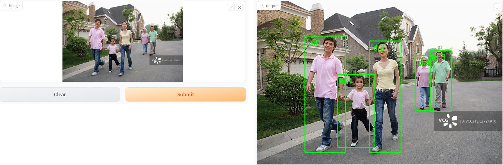

## 快速使用行人检测模型
>基于padddle官方项目整理：https://github.com/PaddlePaddle/PaddleDetection/blob/release/2.6/deploy/pipeline/docs/tutorials/pphuman_mot.md  
>paddle官方PPHuman行人检测+特征匹配重识别(可选)  
>本项目将paddle官方相关代码进行了整理，方便快速简洁地使用
### 1，下载模型到本地
>paddle库2.4.2：https://www.paddlepaddle.org.cn/install/old?docurl=/documentation/docs/zh/develop/install/pip/linux-pip.html
>```
>pip install numpy opencv-python -i https://pypi.tuna.tsinghua.edu.cn/simple
>```
### 2，下载模型到本地
>PP-YOLOE-s(27M)：https://bj.bcebos.com/v1/paddledet/models/pipeline/mot_ppyoloe_s_36e_pipeline.zip  
>PP-YOLOE-l(182M)：https://bj.bcebos.com/v1/paddledet/models/pipeline/mot_ppyoloe_l_36e_pipeline.zip  
>行人重识别特征提取模型REID(85M)：https://bj.bcebos.com/v1/paddledet/models/pipeline/reid_model.zip  
### 3，predict.py
>运行模型，args中有详细设置
### 4，gradio_start.py
>用gradio将程序包装成一个可视化的界面，可以在网页可视化的展示
### 5，flask_start.py
>用flask将程序包装成一个服务，并在服务器上启动
### 6，flask_request.py
>以post请求传输数据调用服务
### 7，gunicorn_config.py
>用gunicorn多进程启动flask服务：gunicorn -c gunicorn_config.py flask_start:app
***
